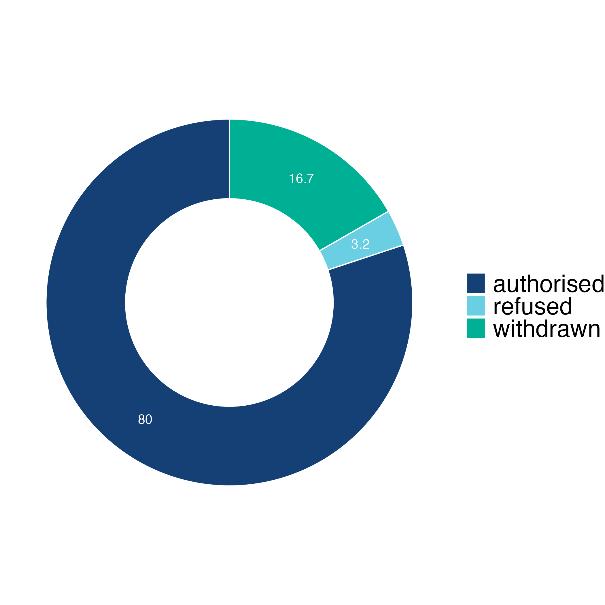

```{r setup, include=FALSE}
knitr::opts_chunk$set(echo = TRUE)
```

# Dataset

The data comes from the European Medicines Agency (EMA) via Miquel Anglada Girotto on GitHub.This is the data for TidyTuesday in 03/14/2023. The European Medicines Agency (EMA) is one of the primary institutions that pharmaceutical companies must interact with to develop and market new drugs. However, publicly available information on EMA's webpage is only accessible through navigation but not unbiased exploration. To address this issue, a small library called EMA_webScrapping was developed using RSelenium package to scrape and explore published information for each drug in the EMA.

After passing preclinical trials and three clinical trials, candidate drugs with good safety and efficacy results have the opportunity to be submitted to regulatory agencies by new drug holders as a New Drug Application (NDA). The European Medicines Agency (EMA) classifies new drug applications into brand-name drugs and generic/biosimilar drugs based on the patent protection status. brand-name drugs are drugs sold by a drug company under a specific name or trademark and that is protected by a patent.Generics (typically small molecules) and biosimilars (typically larger, more complex molecules) are approved through different abbreviated pathways that avoid duplicating certain costly clinical trials.

FDA provides four special qualifications for drugs: fast track, breakthrough therapy, accelerated approval, and priority review. Each of these qualifications is intended to speed up the drug development process. Priority review is applied during the new drug application review stage by the FDA, which reduces the review time from the standard 10 months to 6 months. EMA also provides a similar qualification, called accelerated assessment, which can shorten the approval time from 7 months to 5 months.

FDA and EMA both offer another qualification called orphan drug. Orphan drugs are medicines for the diagnosis, prevention, or treatment of life-threatening or chronically debilitating conditions that are rare or where the medicine is unlikely to generate sufficient profit to justify research and development costs. Drugs that receive orphan drug designation will have a longer period of patent protection and may receive fee reductions in the application process.

```{r, include=FALSE, echo=FALSE}
knitr::opts_chunk$set(echo = TRUE, warning = FALSE, message = FALSE)
library(tidyverse)
library(lubridate)
library(ggplot2)
library(readr)
library(dataReporter)
library(stringr)
library(patchwork)
library(ggrepel)
library(ggvenn)
library(gganimate)

Drug <- readr::read_rds('../data/drugs.rds') 
```

# Authorization Status, Total

For drugs that have submitted NDA, there will be three possible outcomes: authorized, refused, and withdrawn. During the NDA review process, the regulatory agency will also communicate with the drug sponsor. If the sponsor receives negative feedback, they may choose to withdraw the NDA instead of waiting for a refused decision by the regulatory agency. Therefore, the proportion of withdrawn NDA in this donut chart may be higher than that of refused NDA.

```{r, include=FALSE, echo=FALSE}

## pie chart of total authorization status

total_authorization_status <- data.frame(
  status = c("authorised", "refused", "withdrawn"),
  n = c(1267, 51, 265),
  prop = c(80.0, 3.2, 16.7)
) %>%
  arrange(desc(status)) %>%
  mutate(lab.ypos = cumsum(prop) - 0.5*prop)

mycols <- c("#144075", "#6bcfe3", "#00B094")

donut_chart <- ggplot(total_authorization_status, aes(x = 2, y = prop, fill = status)) +
  geom_bar(width = 1, stat = "identity", color = "white") +
  labs(
    title = "Proportion of drugs with different authorization status") +
  coord_polar("y", start = 0)+
  geom_text(aes(y = lab.ypos, label = prop), color = "white")+
  scale_fill_manual(values = mycols) +
  theme_void() +
  xlim(0.2, 2.5) +
  theme(
    legend.title = element_text(size = 5),
    legend.text = element_text(size = 5),
    title = element_text(size = 5),
    legend.position = "bottom" 
  )


ggsave('donut.png',width=3, height=3)
```

```{r, echo=FALSE}

```

# Authorization Status, Brand-Name - Generic/Biosimilar
I would like to create stacked bar charts at this step to reflect the number of drugs with different authorization statuses for each year from 2000 to the present. One chart will show the brand name drugs, and the other chart will show the generic/biosimilar drugs.

In general, The number of brand-name drugs submitting NDA each year is higher than that of generic/biosimilar drugs. The number of the authorized brand-name drug shows an increasing trend. on the contrary, the number of withdrawn brand-name drug shows a decreasing trend. As for the generic/biosimilar drug, Very interesting finding is that EMA did not have any generic/biosimilar applications until 2006. This is because EMA started accepting generic/biosimilar applications in 2006. Before EMA began accepting generic/biosimilar applications, each EU member state had its own regulations and standards for market authorization.

The number of authorized generic/biosimilar drugs was fluctuating on the stacked bar chart. There were some years with a high number of approvals, such as 2009, and other years with fewer approvals, such as 2014. It is interesting to note that from 2021 to present, EMA has not had any generic/biosimilar drug applications withdrawn or refused.

```{r, include=FALSE,echo=FALSE}

bn_drug_count_by_year <- Drug %>% 
  filter(brandname == TRUE) %>%
  filter(year >= 2000 & year <= 2023) %>%
  count(year, authorisation_status) %>%
  tidyr::pivot_wider(
    names_from = authorisation_status,
    values_from = n,
    values_fill = 0
  ) %>%
  tidyr::pivot_longer(
    cols = c(authorised, refused, withdrawn),
    names_to = "status",
    values_to = "count"
  )

# defining color
custom_colors <- c("authorised" = "#4ab57e", "refused" = "#6bcfe3", "withdrawn" = "#3b70c4")

# ggplot
p1 <- ggplot(bn_drug_count_by_year, aes(x = year, y = count, fill = status)) +
  geom_col() +
  scale_x_continuous(breaks = seq(2000, 2023, 5)) +
  scale_fill_manual(values = custom_colors) +
  labs(
    title = "number of brand-name drugs per year by authorisation status",
    x = "Year",
    y = "Count"
  ) +
  theme_minimal() +
  theme(
    axis.title.x = element_text(size = 30),
    axis.title.y = element_text(size = 30),
    axis.text.x = element_text(size = 25),
    axis.text.y = element_text(size = 25),
    legend.title = element_text(size = 25),
    legend.text = element_text(size = 25),
    title = element_text(size = 30),
    legend.position = "bottom" 
  )

# stacked bar plot
p1

ggsave('p1.png',width=16, height=9)

generic_biosimilar_drug_count_by_year <- Drug %>% 
  filter(brandname == FALSE) %>%
  filter(year >= 2000 & year <= 2023) %>%
  count(year, authorisation_status) %>%
  tidyr::pivot_wider(
    names_from = authorisation_status,
    values_from = n,
    values_fill = 0
  ) %>%
  tidyr::pivot_longer(
    cols = c(authorised, refused, withdrawn),
    names_to = "status",
    values_to = "count"
  )

# defining color
custom_colors <- c("authorised" = "#f7892f", "refused" = "#6bcfe3", "withdrawn" = "#3b70c4")

# ggplot
p2 <- ggplot(generic_biosimilar_drug_count_by_year, aes(x = year, y = count, fill = status)) +
  geom_col() +
  scale_x_continuous(breaks = seq(2000, 2023, 5)) +
  scale_fill_manual(values = custom_colors) +
  labs(
    title = "Number of generic/biosimilar drugs per year by authorisation status",
    x = "Year",
    y = "Count"
  ) +
  theme_minimal() +
  theme(
    axis.title.x = element_text(size = 30),
    axis.title.y = element_text(size = 30),
    axis.text.x = element_text(size = 25),
    axis.text.y = element_text(size = 25),
    legend.title = element_text(size = 25),
    legend.text = element_text(size = 25),
    title = element_text(size = 30),
    legend.position = "bottom" 
  )

# stacked bar plot
p2

ggsave('p2.png',width=16, height=4.5)


p12 <- p1 + p2

p12

ggsave('p12.png', width=32, height=16)
```

```{r, echo=FALSE}
knitr::include_graphics('p12.png')
```

# The most common indication - Brand-Name - Generic/Biosimilar

Afterwards, I selected the top 10 indications with the highest frequency of occurrence for brand-name drugs and generic/biosimilar drugs based on the total number of indications approved from 2000 to present. Frequently occurring indications can indicate hotspots in drug development. I counted the number of occurrences for each indication, sorted them in descending order, and kept the top 10. A bar chart was created to show the most frequently occurring indications and their frequency of occurrence.

As for the top 10 frequent indication in authorized brand-name drug. the types of indications were diverse, including non-communicable diseases like diabetes, CPOD, and lung cancer.Due to the classification of Diabetes, it is divided into Type II Diabetes and Type I Diabetes (only Type II Diabetes is labeled in the data, and Type I Diabetes is not classified). Therefore, the actual total number of diabetes drugs for treatment is significantly higher than the second-ranking HIV drugs. As for infectious diseases, HIV is the indication with the highest number of drugs approved by EMA this century, followed by Covid-19.

As for the generic/biosimilar drugs, a very interesting finding is that there is an apparent change in the top 10 indications. The first place has shifted from diabetes drugs to breast cancer drugs. Half of the top 10 indications were related to autoimmune diseases (such as rheumatoid arthritis, ankylosing spondylitis, psoriasis, epilepsy, and Arthritis). As far as I know, the best-selling drug of the past few decades is Abbvie's Humira, a drug used to treat a variety of autoimmune diseases. Given the huge market potential, it is not surprising that so many generic/biosimilar drugs are targeting autoimmune diseases. On the other hand, the absence of diabetes from the top indications for generic/biosimilar drugs is a result of brand-name drug holders setting up high barriers of patent protection. The consequence is that diabetes patients must pay high prices for brand-name drugs due to the lack of sufficient competition from generic drugs.

```{r, include=FALSE,echo=FALSE}
## Top indications for brand name drugs
# Find the indications for all brand name drugs in the database, count their quantity and sort them in descending order.
bn_disease_counts <- Drug %>%
  filter(brandname == TRUE) %>%
  filter(authorisation_status == "authorised") %>%
  filter(year >= 2000 & year <= 2023) %>%
  separate_rows(therapeutic_area, sep = ";") %>%
  mutate(therapeutic_area = str_trim(therapeutic_area)) %>%
  mutate(therapeutic_area = case_when(
    therapeutic_area == "Carcinoma, Non-Small-Cell Lung" ~ "NSCLC",
    therapeutic_area == "Pulmonary Disease, Chronic Obstructive" ~ "Chronic Pilmonary",
    TRUE ~ therapeutic_area
  )) %>%
  count(therapeutic_area, sort = TRUE)

bn_disease_counts

# Select the top 10 diseases, and create the bar plot
bn_top_10_diseases <- bn_disease_counts %>%
  top_n(10, n)

p3 <- ggplot(bn_top_10_diseases, aes(x = reorder(therapeutic_area, n), y = n)) +
  geom_bar(stat = "identity", fill = "#4ab57e") +
  coord_flip() +
  labs(
    title = "Top 10 Frequent Indication in Authurised Brand-Name Drugs",
    x = "Indication",
    y = "Frequency"
  ) +
  theme_minimal() +
  coord_flip() + 
  theme(
    axis.title.x = element_text(size = 30),
    axis.title.y = element_text(size = 30),
    axis.text.x = element_text(size = 25),
    axis.text.y = element_text(size = 20),
    title = element_text(size = 30)
  )
p3

ggsave('p3.png',width=16, height=9)

## Top indications for generic & biosimilar drugs
# Find the indications for all generic & biosimilar drugs in the database, count their quantity and sort them in descending order.
generic_biosimilar_disease_counts <- Drug %>%
  filter(brandname == FALSE) %>%
  filter(authorisation_status == "authorised") %>%
  filter(year >= 2000 & year <= 2023) %>%
  separate_rows(therapeutic_area, sep = ";") %>%
  mutate(therapeutic_area = str_trim(therapeutic_area)) %>%
  mutate(therapeutic_area = case_when(
    therapeutic_area == "Carcinoma, Non-Small-Cell Lung" ~ "NSCLC",
    therapeutic_area == "Pulmonary Disease, Chronic Obstructive" ~ "Chronic Pilmonary",
    TRUE ~ therapeutic_area
  )) %>%
  count(therapeutic_area, sort = TRUE)

generic_biosimilar_disease_counts

# Select the top 10 diseases, and create the bar plot

generic_biosimilar_top_10_diseases <- generic_biosimilar_disease_counts %>%
  top_n(10, n)

p4 <- ggplot(generic_biosimilar_top_10_diseases, aes(x = reorder(therapeutic_area, n), y = n)) +
  geom_bar(stat = "identity", fill = "#f7892f") +
  coord_flip() +
  labs(
    title = "Top 10 Indication in Authurised Generic & Biosimilar Drugs",
    x = "Indication",
    y = "Frequency"
  ) +
  theme_minimal() +
  coord_flip() + 
  theme(
    axis.title.x = element_text(size = 30),
    axis.title.y = element_text(size = 30),
    axis.text.x = element_text(size = 25),
    axis.text.y = element_text(size = 20),
    title = element_text(size = 30)
  )
p4

ggsave('p4.png',width=16, height=9)

p34 <- p3 + p4

p34

ggsave('p34.png', width=32, height=16)
```

```{r, echo=FALSE}
knitr::include_graphics('p34.png')
```

# New drug holders

Next, I broke down the results of each drug holder's applications. I planned to visualize the relationship between the number of drugs approved and each holder. Therefore, I first created a Voronoi treemap. The advantage of a treemap is that it not only shows the authorized drugs but also distinguishes the cases with the withdrawn and refused drugs through different color blocks. However, since treemaps cannot be combined with other graphs on the same page using patchwork, I opted for a scatter plot instead. The x-axis represents the number of applications, and the y-axis represents the number of authorized applications. A diagonal line is also drawn to assist in analysis. The closer the point is to the diagonal line, the higher the authorization rate of the holder, while the points in the upper right corner represent holders with a higher number of applications.

Swiss pharmaceutical giant Novartis has applied for the most NDAs and has also been authorized to market the most brand name drugs. However, they also have the highest number of refused or withdrawn applications. Scatter plot also shows many well-known pharmaceutical giants such as Merck, Johnson & Johnson, GSK in the upper right corner.

Except for Israeli generic drug giant Teva, the spots for other generic drug holders are relatively close to the diagonal line. Generic drugs have a higher approval rate than brand-name drugs during the application for market launch phase. This is related to their need to submit generic consistency testing data only.

```{r, include=FALSE,echo=FALSE}
## Drug Holders by Total Applications: Application vs Authorised Count
# Summarize the data
bn_holder_summary <- Drug %>% 
  filter(brandname == TRUE) %>%
  filter(year >= 2000 & year <= 2023) %>%
  group_by(holder_name, authorisation_status) %>%
  summarise(application_count = n()) %>%
  ungroup() %>%
  spread(authorisation_status, application_count, fill = 0) %>%
  mutate(total_applications = authorised + refused + withdrawn) %>%
  arrange(desc(total_applications))

# Select top 30 companies by total applications
top_30_companies <- bn_holder_summary %>%
  arrange(desc(total_applications)) %>%
  head(30)

# Plot the data
p5 <- ggplot(top_30_companies, aes(x = total_applications, y = authorised, label = holder_name)) +
  geom_point(aes(color = holder_name), size = 10, alpha = 0.8) +
  geom_abline(slope = 1, intercept = 0, linetype = "dashed", color = "gray", size = 2) +
  labs(title = "Top 30 Brand-Name Drug Holders: Application vs Authorised Count",
       x = "Number of Applications",
       y = "Number of Authorised Applications") +
  theme_minimal() +
  theme(
    axis.title.x = element_text(size = 30),
    axis.title.y = element_text(size = 30),
    axis.text.x = element_text(size = 25),
    axis.text.y = element_text(size = 25),
    title = element_text(size = 15),
    legend.position = "none"
  ) +
  geom_text_repel(size = 10)

ggsave('p5.png',width=16, height=16)

## Drug Holders by Total Applications: Application vs Authorised Count
# Summarize the data
generic_biosimilar_holder_summary <- Drug %>% 
  filter(brandname == FALSE) %>%
  filter(year >= 2000 & year <= 2023) %>%
  group_by(holder_name, authorisation_status) %>%
  summarise(application_count = n()) %>%
  ungroup() %>%
  spread(authorisation_status, application_count, fill = 0) %>%
  mutate(total_applications = authorised + refused + withdrawn) %>%
  arrange(desc(total_applications))

# Select top 30 companies by total applications
generic_biosimilar_top_30_companies <- generic_biosimilar_holder_summary %>%
  arrange(desc(total_applications)) %>%
  head(20)

# Plot the data
p6 <- ggplot(generic_biosimilar_top_30_companies, aes(x = total_applications, y = authorised, label = holder_name)) +
  geom_point(aes(color = holder_name), size = 7, alpha = 0.8) +
  geom_abline(slope = 1, intercept = 0, linetype = "dashed", color = "gray", size = 2) +
  labs(title = "Top 20 Generic & Biosimilar Drug Holders",
       x = "Number of Applications",
       y = "Number of Authorised Applications") +
  theme_minimal() +
  theme(
    axis.title.x = element_text(size = 30),
    axis.title.y = element_text(size = 30),
    axis.text.x = element_text(size = 25),
    axis.text.y = element_text(size = 25),
    title = element_text(size = 15),
    legend.position = "none"
  ) +
  geom_text_repel(size = 10)

ggsave('p6.png',width=16, height=16)

p56 <- p5 + p6

p56

ggsave('p56.png',width=16, height=16)
```

```{r, echo=FALSE}
knitr::include_graphics('p56.png')
```

# Number of authorized brand-name drugs, by genre

The Venn diagram clarifies the relationships between brand-name drugs, orphan drugs, and accelerated assessment drugs. The Venn diagram shows that only brand-name drugs have orphan drug and accelerated assessment drug certifications, while generic/biosimilar drugs do not have either certification. Additionally, 18 drugs have received both certifications. Relatively speaking, it seems easier to obtain orphan drug certification than accelerated assessment certification.

After 2010, the number of drugs granted orphan drug status by EMA has shown an upward trend. In contrast, except for a period between 2015 and 2019 when EMA granted a certain number of drugs accelerated assessment status, it has been rare for drugs to be allowed to be approved for marketing at an accelerated pace. The number of authorized accelerated assessments has almost "disappeared" since 2019.

```{r, include=FALSE,echo=FALSE}

# Approved Orphan & Accelerated Assessment Medicine
orphan_accelerate_drug <- Drug %>% 
  filter(brandname == TRUE) %>%
  filter(year >= 2000) %>%
  filter(authorisation_status == "authorised") %>%
  mutate(bn_drug_genre = case_when(orphan_medicine == FALSE & accelerated_assessment == FALSE ~ "brandname_only",
                                orphan_medicine == TRUE & accelerated_assessment == FALSE ~ "orphan_only",
                                accelerated_assessment == TRUE ~ "accelerated",
                                TRUE ~ NA_character_)) 

# Count by Year
orphan_accelerate_drug_count_by_year <- orphan_accelerate_drug %>%
  count(year, bn_drug_genre) %>%
  tidyr::pivot_wider(
    names_from = bn_drug_genre,
    values_from = n,
    values_fill = 0
  ) %>%
  tidyr::pivot_longer(
    cols = c(brandname_only, orphan_only, accelerated),
    names_to = "Genre",
    values_to = "count"
  )

# defining color
orphan_colors <- c("brandname_only" = "#4ab57e", "orphan_only" = "#f5f264", "accelerated" = "#3b70c4")

# ggplot
p7 <- ggplot(orphan_accelerate_drug_count_by_year, aes(x = year, y = count, fill = Genre)) +
  geom_col() +
  scale_x_continuous(breaks = seq(2000, 2023, 5)) +
  scale_fill_manual(values = orphan_colors) +
  labs(
    title = "Number of Authorized Brand Name Drugs per Year by Genre",
    x = "Year",
    y = "Count"
  ) +
  theme_minimal() +
  theme(
    axis.title.x = element_text(size = 30),
    axis.title.y = element_text(size = 30),
    axis.text.x = element_text(size = 30),
    axis.text.y = element_text(size = 30),
    legend.title = element_text(size = 30),
    legend.text = element_text(size = 30),
    title = element_text(size = 40),
    legend.position = "bottom" 
  )

# stacked bar plot
p7

ggsave('p7.png',width=16, height=9)

# create id colunm
orphan_accelerate_drug <- orphan_accelerate_drug %>%
  mutate(id = row_number())

# create set1
set1 <- orphan_accelerate_drug$id

# create set2
set2 <- orphan_accelerate_drug %>%
  filter(orphan_medicine == TRUE) %>%
  pull(id)

# create set3
set3 <- orphan_accelerate_drug %>%
  filter(accelerated_assessment == TRUE) %>%
  pull(id)

# use ggvenn to create venn

venn_data <- (list(Brandname = set1, Orphan = set2, Accelerated = set3))

p8 <- ggvenn(venn_data, set_name_size = 15, text_size = 13) + 
  scale_fill_manual(values = c("#4ab57e", "#f5f264", "#3b70c4"))

p8

ggsave('p8.png',width=20, height=20)

p8 + p7

p87 <- p8+p7

p87

ggsave('p87.png', width=32, height=16)

```

```{r, echo=FALSE}
knitr::include_graphics('p87.png')
```

The drug that received accelerated assessment qualification in 2021 was not a Covid-19 infection treatment drug. In fact, Covid-19 vaccines and therapeutic neutralizing antibodies have obtained another type of qualification called emergency use authorization (EUA). This is a special measure to save new drug evaluation and approval time during the pandemic. Even with EUA, Covid-19 drugs still need to be authorized for marketing through the regular new drug review process. There was no COVID-19 vaccine or treatment that has been granted orphan drug or accelerated assessment by EMA.

```{r, echo=FALSE}
accelerated_21 <- orphan_accelerate_drug %>%
  filter(accelerated_assessment == "TRUE") %>%
  filter(year == "2021") %>%
  select(therapeutic_area)

# Find the indications of the drugs that received accelerated assessment qualification in 2021.

accelerated_21

```

# Orphan drug & Accelerated assessment drug

For orphan drugs and accelerated assessment drugs, I want to know their most common indications, as well as the holders and authorized years of each common indication drug. This will help me understand which years each common indication was authorized, and which holders are mainly focused on this indication.

Most of the indications for orphan drugs have only appeared 1-2 times. I have kept the indications that appeared more than 3 times. Among them, hemophilia, leukemia, lymphoma, and myeloma are all blood diseases (11.6%, 17 out of 146). Therefore, over the past decade, EMA has approved many orphan drugs for indications related to blood diseases.

```{r, include=FALSE,echo=FALSE}
orphan_drug_indication <- orphan_accelerate_drug %>%
  filter(bn_drug_genre == "orphan_only") %>%
  separate_rows(therapeutic_area, sep = ";") %>%
  mutate(therapeutic_area = str_trim(therapeutic_area)) %>%
  count(therapeutic_area, sort = TRUE) %>%
  slice(1:7)

orphan_drug_indication <- orphan_accelerate_drug %>%
  filter(bn_drug_genre == "orphan_only") %>%
  separate_rows(therapeutic_area, sep = ";") %>%
  mutate(therapeutic_area = str_trim(therapeutic_area)) %>%
  semi_join(orphan_drug_indication, by = "therapeutic_area") %>%
  separate_rows(therapeutic_area, sep = ";") %>%
  mutate(therapeutic_area = str_trim(therapeutic_area))

top_drugs <- orphan_drug_indication %>%
  count(therapeutic_area, sort = TRUE) %>%
  slice(1:7) %>%
  pull(therapeutic_area)


p9 <- ggplot(orphan_drug_indication %>% filter(therapeutic_area %in% top_drugs),
       aes(x = year, y = holder_name, color = therapeutic_area)) +
  geom_point(size = 3) +
  facet_wrap(~ therapeutic_area, ncol = 2, scales = "free_y") +
  scale_x_continuous(breaks = seq(2011, 2023, 3)) +
  labs(
    title = "",
    x = "Approval Year",
    y = "Holder Name"
  ) +
  theme_minimal() +
  theme(
    axis.title.x = element_text(size = 16),
    axis.title.y = element_text(size = 16),
    axis.text.x = element_text(size = 12),
    axis.text.y = element_text(size = 10),
    legend.position = "right",
    legend.text = element_text(size = 10),
    legend.title = element_text(size = 12),
    strip.text = element_text(size = 12),
    strip.background = element_rect(fill = "#f5f5f5"),
    title = element_text(size = 16)
  )

p9

ggsave('p9.png',width=16, height=9)
```

```{r, echo=FALSE}
knitr::include_graphics('p9.png')
```
Most of the indications for accelerated assessment drugs only appeared once. I kept the indications that appeared more than twice. These indications were diverse. However, myeloma once again appeared as one of the most common indications. Both BMS and J&J had more than one drug approved (orphan or accelerated assessment) for this indication, and they did not overlap. After checking the active ingredients of the approved drugs, I confirmed that the immunotherapy drugs approved by BMS and J&J in 2016, and the cell therapy drugs approved by them as orphan drugs for myeloma indication in 2019 and 2021, respectively.
```{r, include=FALSE,echo=FALSE}
accelerated_indication <- orphan_accelerate_drug %>%
  filter(bn_drug_genre == "accelerated") %>%
  separate_rows(therapeutic_area, sep = ";") %>%
  mutate(therapeutic_area = str_trim(therapeutic_area)) %>%
  count(therapeutic_area, sort = TRUE) %>%
  slice(1:5)

accelerated_indication <- orphan_accelerate_drug %>%
  filter(bn_drug_genre == "accelerated") %>%
  separate_rows(therapeutic_area, sep = ";") %>%
  mutate(therapeutic_area = str_trim(therapeutic_area)) %>%
  semi_join(accelerated_indication, by = "therapeutic_area") %>%
  separate_rows(therapeutic_area, sep = ";") %>%
  mutate(therapeutic_area = str_trim(therapeutic_area))

top2_drugs <- accelerated_indication %>%
  count(therapeutic_area, sort = TRUE) %>%
    slice(1:5) %>%
  pull(therapeutic_area)


p10 <- ggplot(accelerated_indication %>% filter(therapeutic_area %in% top2_drugs),
       aes(x = year, y = holder_name, color = therapeutic_area)) +
  geom_point(size = 3) +
  facet_wrap(~ therapeutic_area, ncol = 2, scales = "free_y") +
  labs(
    title = "",
    x = "Approval Year",
    y = "Holder Name"
  ) +
  theme_minimal() +
  theme(
    axis.title.x = element_text(size = 16),
    axis.title.y = element_text(size = 16),
    axis.text.x = element_text(size = 12),
    axis.text.y = element_text(size = 10),
    legend.position = "right",
    legend.text = element_text(size = 10),
    legend.title = element_text(size = 12),
    strip.text = element_text(size = 12),
    strip.background = element_rect(fill = "#f5f5f5"),
    title = element_text(size = 16)
  )

p10

ggsave('p10.png',width=16, height=9)
```

```{r, echo=FALSE}
knitr::include_graphics('p10.png')
```
# Limitation

1. Insufficient representativeness of data

Firstly, the data in this dataset only includes drugs in the NDA phase, but drug development is a long and highly selective process, where a large number of candidates are eliminated during the pre-clinical and clinical phases. Therefore, selecting only drugs in the NDA phase cannot fully represent the situation of drug development. The proportion of drugs approved for marketing in this phase is very high, which is different from the extremely high failure rate in the clinical phase.


2. Whether the data can represent Europe needs to be further discussed. 

The source of this dataset is EMA, so the data is indeed from within Europe, but it cannot represent the entire Europe. The drug approval agencies and processes may differ in different countries and regions, so the representativeness of the data needs to be carefully considered. In addition, this dataset only includes drugs approved by EMA and does not include the drug approval situation in other European countries. Therefore, the limitations of this dataset need to be considered when using it.

In addition, the current drug evaluation data has cross-nationality. The development of the ICH unified declaration system allows drugs to use clinical trial data from other regions and apply for marketing authorization from another regulatory agency with only a small amount of bridging data. My topic is the development of European drugs, but American and Japanese pharmaceutical companies usually do not choose to conduct clinical trials only in Europe. They may only conduct clinical trials in their own countries and then bridge the data to EMA. Of course, some pharmaceutical companies conducted international multicenter clinical trials. If it cannot be determined whether NDA drugs have undergone clinical trials in Europe, their representativeness of drug development in Europe is questionable.

